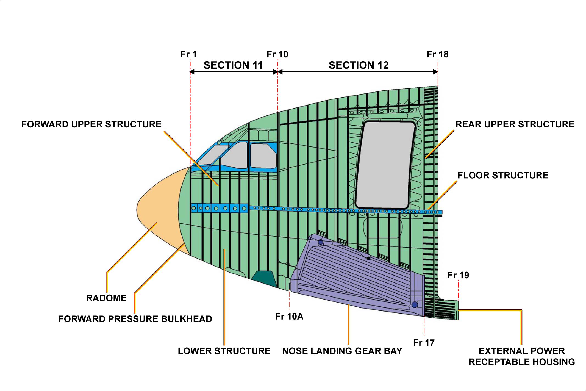
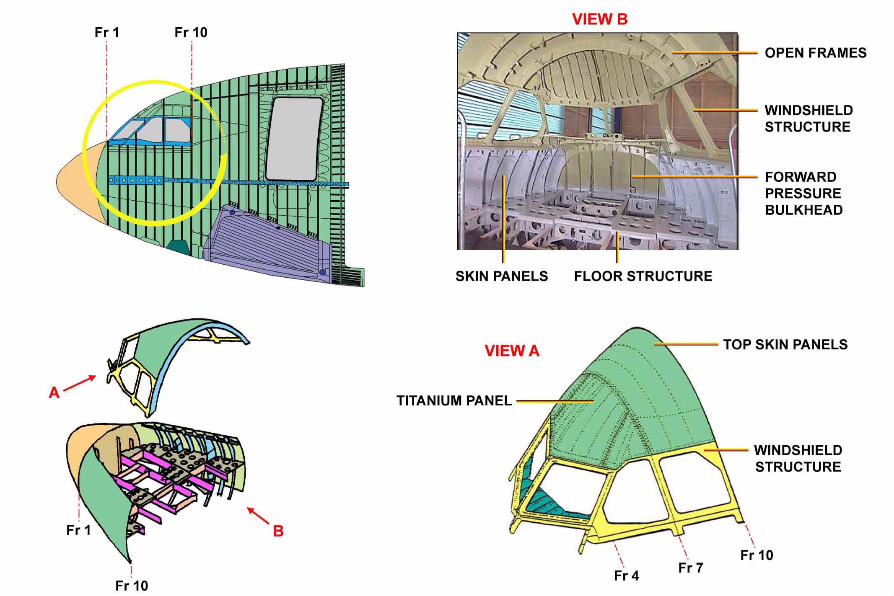
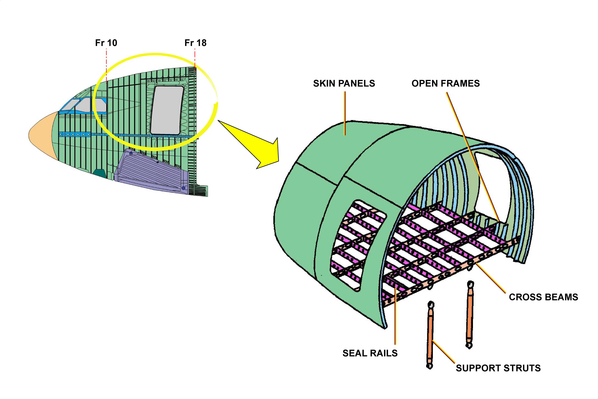
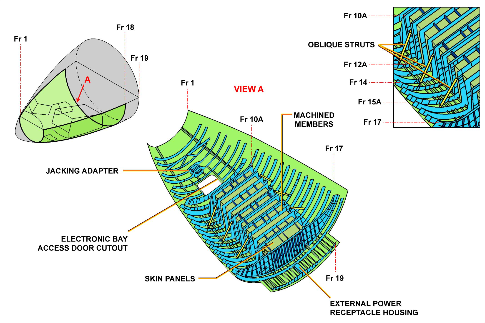

# 10、机头

机头部分又细分为 3 个主要部分：

- 前上部分（驾驶舱区域）
- 后上部分
- 下部

## 1.1 前上部分

前上部分主要包括：

- 封闭式部分
- 开放式部分（风挡和侧窗）
- 前增压隔板
- 地板支撑结构
- 蒙皮板
- 风挡结构

## 1.2 后上部分

后上部分主要包括：

- 封闭式部分、纵梁、蒙皮
- 开放式部分（旅客和机组舱门）
- 旅客和机组舱门框结构
- 地板结构（横梁、座椅导轨及连接到前起落架舱的支撑杆）

## 1.3 下部分

下部分主要包括：

- 前起落架舱
- 前顶升接合器
- 电子舱门
- 外部电源插座壳

